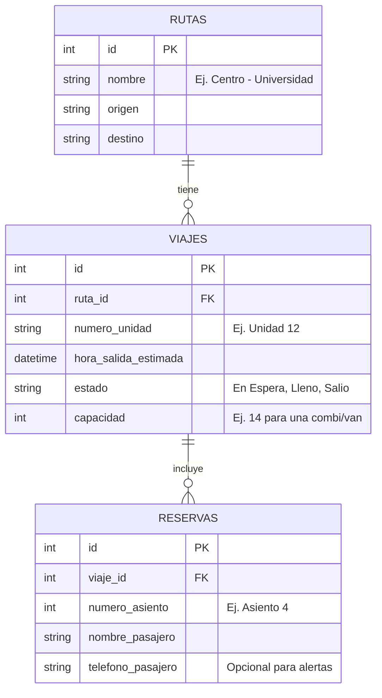

# Plan de Accion y Arquitectura del Proyecto

Este documento contiene la estructura tecnica de la aplicacion de reserva de transporte

## 1. Plan de Desarrollo
Aqui tienen el plan dividido en 4 fases:

1. **Fase 1: Configuracion**
   - Inicializar repositorios (Frontend y Backend).
   - Configurar la Base de Datos.
   - Definir la paleta de colores y el framework CSS (recomendado: Tailwind CSS).
2. **Fase 2: Backend & Base de Datos (4-6 horas)**
   - Crear las tablas/colecciones en la base de datos.
   - Desarrollar la API REST.
   - Probar los endpoints con Postman o Insomnia.
3. **Fase 3: Frontend y UX**
   - Construir la vista principal.
   - Crear el componente interactivo del croquis de asientos.
   - Conectar el Frontend con la API.
   - Integrar los espacios simulados para publicidad.
4. **Fase 4: Refinamiento y Presentacion**
   - Corregir bugs visuales.
   - Preparar datos falsos para el test.

---

## GERA
## 2. Base de Datos (Esquema Relacional)

Para mantenerlo simple, usaremos 3 entidades principales. Sam si usas SQL (PostgreSQL/MySQL) o NoSQL (Firebase/MongoDB), la logica es la misma.

---

## Carlitos
## 3. API (Endpoints del Backend)

**Stack Seleccionado:** Python con el framework **FastAPI**. Carlitos FastAPI es ideal para este proyecto porque es muy rapido y genera automaticamente la documentacian interactiva

El backend sera una API RESTful que se comunicara con el frontend mediante JSON.

### Rutas
- `GET /api/rutas`
  - **Descripcion:** Devuelve la lista de bases/rutas disponibles.
  
### Viajes
- `GET /api/viajes/activos?ruta_id=1`
  - **Descripcion:** Devuelve los datos del proximo carro en salir para una ruta especofica, incluyendo quo asientos ya eston reservados.
  - **Respuesta:** `{ "viaje_id": 102, "numero_unidad": "12", "capacidad": 14, "asientos_ocupados": [1, 2, 5], "hora_estimada": "10:15 AM" }`

### Reservas
- `POST /api/reservas`
  - **Descripcion:** Aparta un asiento.
  - **Body (JSON):** `{ "viaje_id": 102, "numero_asiento": 4, "nombre_pasajero": "Juan Perez" }`
  - **Respuesta:** oxito o Error (si alguien mas lo tomo un segundo antes).

### Chofer / Checador
- `POST /api/viajes/:id/salir`
  - **Descripcion:** El chofer/checador presiona este boton al llenarse el carro. Cambia el estado del viaje a "Salio" y crea un nuevo viaje vacio para el siguiente carro en fila.

---

## Angel
## 4. Frontend (Interfaces de Usuario)

Para que el proyecto luzca completo, usare 3 vistas principales.

### Vista 1: Inicio (Seleccion)
- **UI:** Un buscador o lista de rutas disponibles (Ej. Base Centro).
- **Monetizacion:** Un pequeño banner publicitario en la parte inferior.

### Vista 2: Detalle y Reserva (El corazon de la app)
- **UI:** Un recuadro indicando "Siguiente unidad sale en: 10 mins".
- **Croquis Interactivo:** Una cuadricula simulando los asientos del vehiculo.
  - 🟩 **Verde:** Libre (Clickable).
  - 🟥 **Rojo:** Ocupado (No clickable).
  - 🟨 **Amarillo:** Seleccionado por el usuario.
- **Formulario:** Al seleccionar asiento, pide solo el nombre para apartar.

### Vista 3: Confirmacion (Boleto Digital)
- **UI:** Muestra un ticket con el numero de asiento, el numero de la unidad y la hora de salida.
- **Monetizacion (Fuerte):** Aqui mostrare publicidad de alto impacto

### Vista 4: Panel del Chofer (Oculta para usuarios)
- **UI:** Vista muy simple con un boton gigante que dice "Iniciar Ruta" y una lista de los nombres de los pasajeros para verificar que suban.

---

## Emma
### Estar pendiente para la documentacion